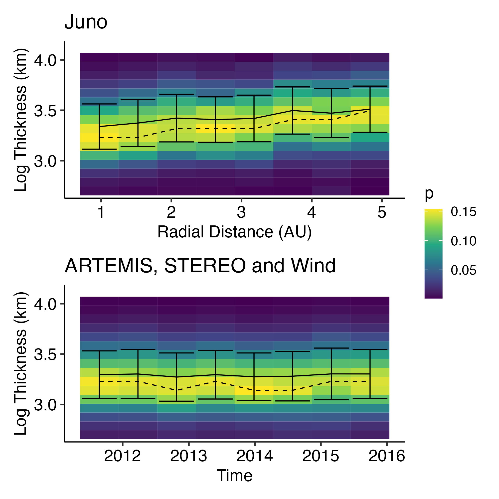
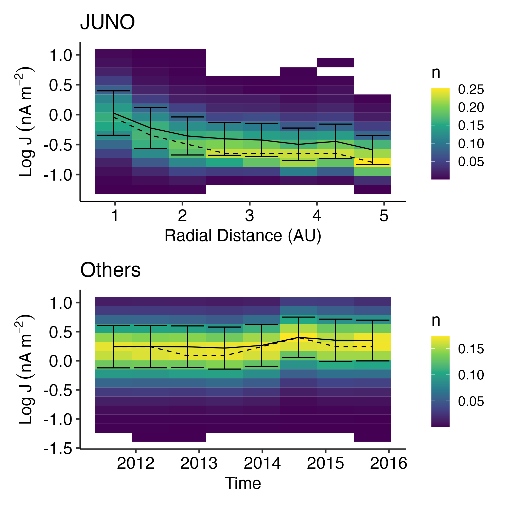

## Introduction & Motivation

'Discontinuities' are discontinuous spatial changes in plasma
parameters/characteristics and magnetic fields [@colburn1966].

{width="48%"} {width="48%"}

@söding2001 studied the radial distribution of discontinuities in the
solar wind.

{width="60%"}

{width="38%"}

Joint observations of JUNO & ARTEMIS & Other missions really provides a
unique opportunity!!!

## Method

-   We use [@liu2022a] method to identify IDs, which has better
    compatibility for the IDs with minor field changes.
-   Then the minimum variance analysis is applied to each ID event to
    obtain the boundary normal (LMN) coordinate and extract IDs'
    features.
-   Hamiltonian model is applied for investigation of ion dynamics in
    the solar wind discontinuity configuration.

## Results

{width="48%"}

{width="48%"}
{width="48%"}

{width="48%"}

{width="48%"}
