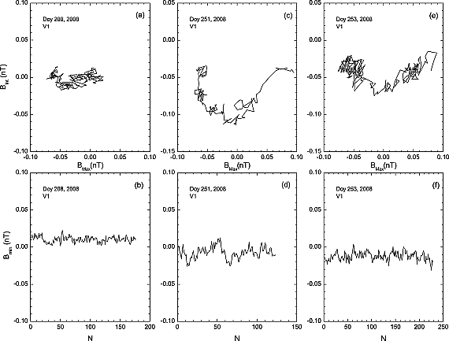

## Introduction & Motivation

'Discontinuities' are discontinuous spatial changes in plasma parameters/characteristics and magnetic fields [@colburn1966]. They are observed across the heliosphere from inner heliosphere [@liu2022] to the heliosheath [@burlaga2011].

@söding2001 studied the radial distribution of discontinuities in the solar wind.

Joint observations of JUNO & ARTEMIS & Other missions really provides a unique opportunity!!!

## Method

## Conclusion


